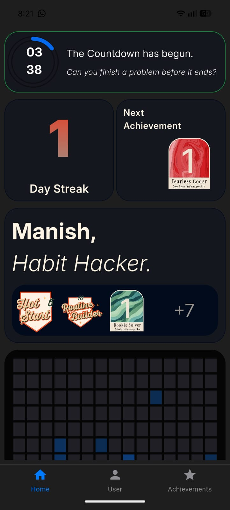
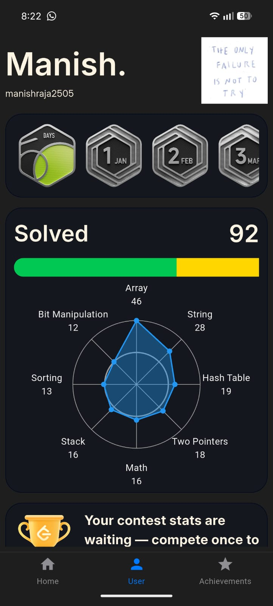
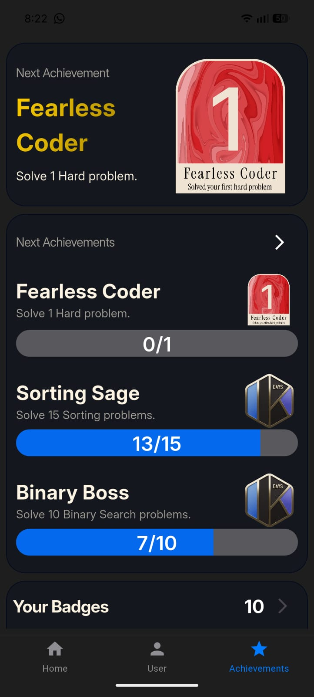
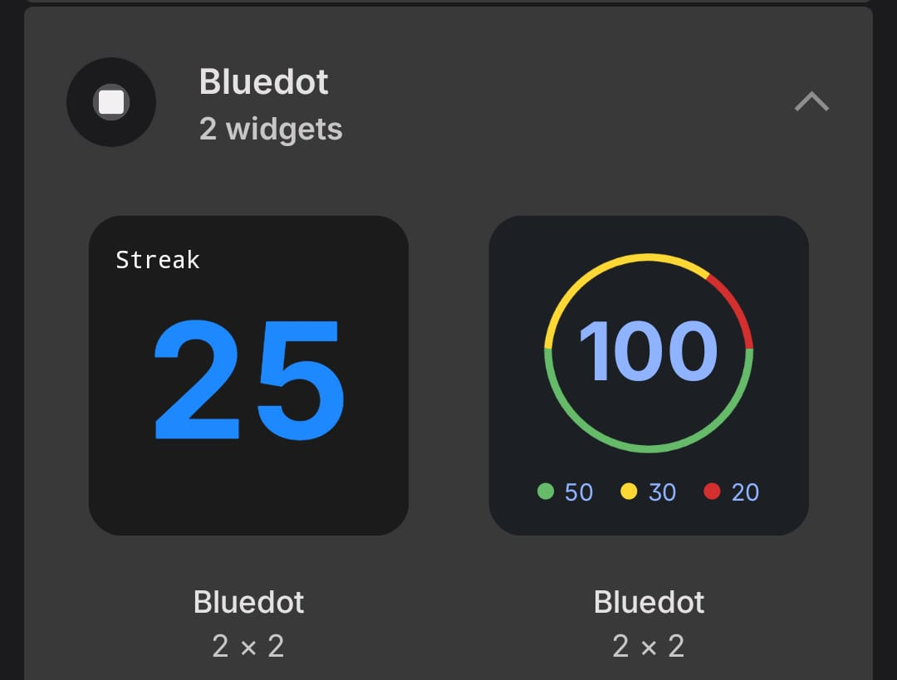

# 🔵 Bluedot
### Level Up Your Coding Journey with Your LeetCode Companion.

**Struggling to stay consistent with LeetCode?**
Bluedot is your new coding accountability partner. Designed to boost consistency, motivation, and skill growth, Bluedot combines a clean UI, smart insights, and rewarding achievements to help you crush your interview prep.

---

## 📱 App Screenshots

| Dashboard | Stats & Progress | Achievements | Android Widgets |
|:---------:|:----------------:|:------------:|:---------------:|
|  |  |  |  |

---

## 🚀 Features

### ⭐ Real-Time LeetCode Stats
* **Live Tracking:** Track solved problems, current streaks, and difficulty breakdowns (Easy/Medium/Hard).
* **Visualizations:** Beautiful charts and progress bars to keep you motivated.
* **Auto-Sync:** Seamlessly syncs with your public LeetCode profile.

### 🎯 Daily Motivation & Goals
* **Milestones:** Set and hit daily goals to maintain high consistency.
* **Motivation:** Gentle nudges and quotes to get you through the toughest algorithms.

### 🏅 Gamified Achievements
Unlock beautifully designed badges as you progress:
* **Streak Master:** Hit 7, 30, and 100-day streak milestones.
* **Difficulty Slayer:** Conquer specific tiers of problem difficulty.
* **Consistency King:** Reach expert levels of daily activity.

### 🧩 Native Android Widgets (New!)
Stay updated without opening the app. We've built **2 custom widgets using Kotlin**:
1.  **Streak Widget:** Quick view of your current active streak.
2.  **Progress Widget:** A snapshot of your total solved problems by difficulty.

### 🎨 Developer-First UI/UX
* **Distraction-Free:** Clean interface designed for focus.
* **Dark Mode:** Fully optimized for late-night coding sessions.
* **Smooth Interactions:** Delightful animations and micro-interactions.

---

## 🛠️ Tech Stack

* **Framework:** [Flutter](https://flutter.dev/) (Dart)
* **Native Integration:** [Kotlin](https://kotlinlang.org/) (for Android Home Screen Widgets)
* **State Management:** Riverpod
* **API:** LeetCode GraphQL / Public API

  
Made with ❤️ by Manish

